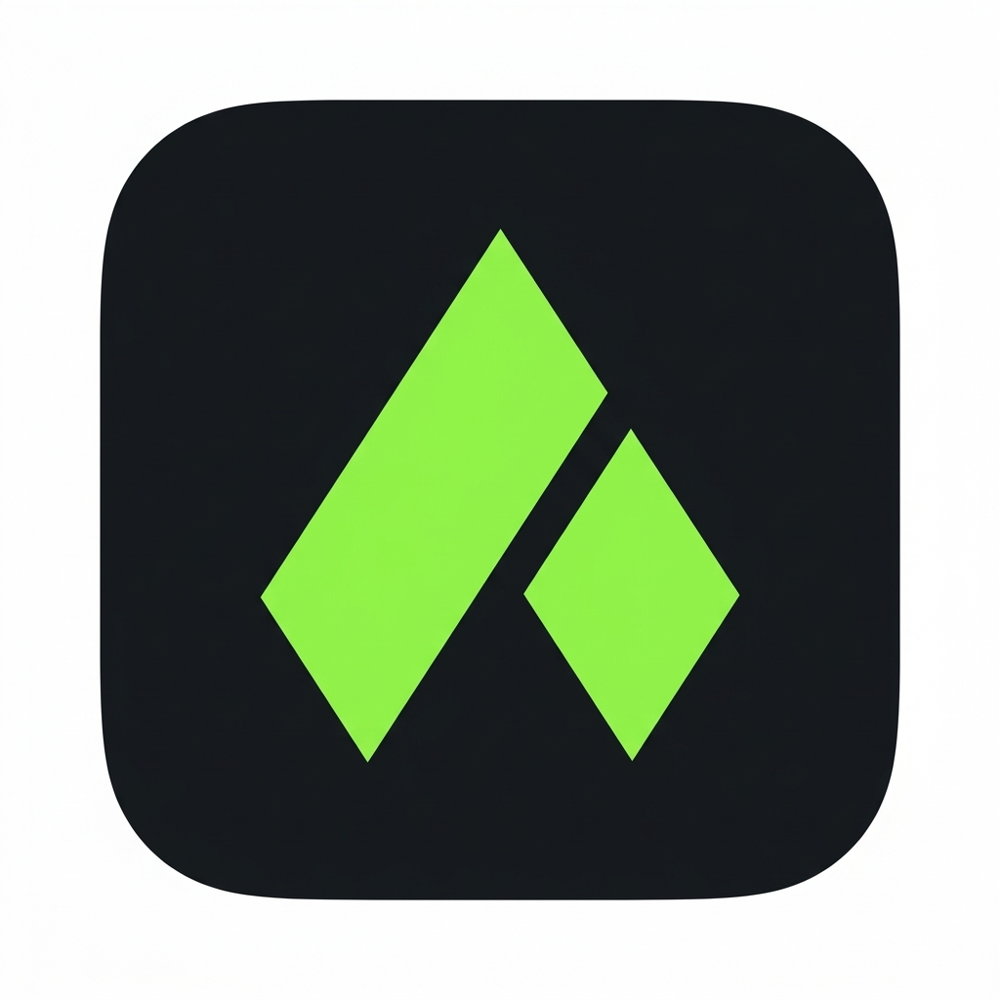
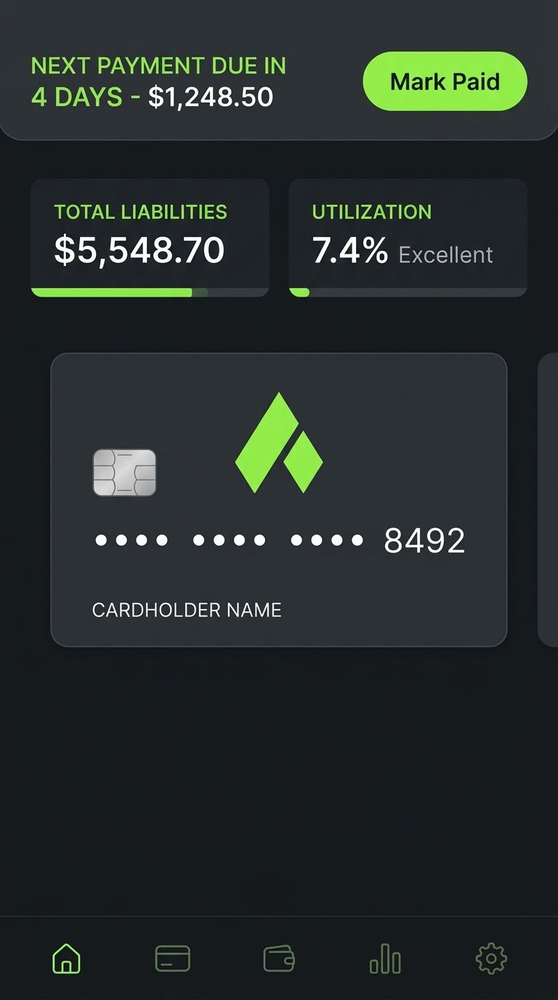

# 🛡️ Aegis: Credit, Garage & Asset Command Center
> **Official Submission for the RevenueCat Shipaton 2026 Hackathon**

<p align="center">
  
</p>

Aegis is an ultra-luxury, non-custodial command center unifying **Multi-Card Credit Due-Date Tracking**, **Automotive Garage Equity & Telematics**, and **Gamified External Bill Payments** into a single high-net-worth mobile app.

---

## 🏆 Hackathon Target Categories

* **The HAMM Award (Help Apps Make Money)** — RevenueCat multi-tier subscription engine (`gold_pass` & `black_edition`)
* **Keep Them Coming Back Award (OneSignal)** — Intelligent 3-day due date countdowns, payment celebrations & recall pushes (App ID: `d9515184-c70b-438c-8d11-92905402c913`)
* **RevenueCat Design Award** — Flat matte dark obsidian UI, 3D flip card physics & real-time utilization meters
* **Best App for Galaxy** — Samsung Galaxy Store release
* **The Grand Prize** ($100,000)

---

## 📸 App Preview

<p align="center">
  
</p>

---

## ✨ Core Pillars

### 1. Multi-Card Due Date Radar
* **Aggregated Countdown:** Real-time countdown to the earliest statement due date across all cards (Amex, Chase, Capital One).
* **3D Flip Cards:** Interactive 3D cards displaying current balances, available credit, statement balances, APRs, and utilization ratios.
* **Credit Utilization Shield:** Smart alerts when revolving credit utilization crosses 10% or 30%, protecting credit scores.

### 2. Zero-MTL Gamified Rewards Loop
* **Non-Custodial Tracking:** Eliminates costly Money Transmitter Licenses (MTLs) by tracking external payments rather than moving money directly.
* **Balance Drop Verification:** Detects when statement balances drop near due dates, verifying external payments and minting **Aegis Coins**.
* **Curated Perks:** Redeem coins for Apple Gift Cards, Uber Black vouchers, and Equinox guest passes.

### 3. The Aegis Garage
* **NHTSA 17-Digit VIN Decoder:** Official US Government NHTSA vPIC REST API integration for instant vehicle specs, trim, and safety recalls.
* **Equity Calculator:** Real-time vehicle resale valuation against auto loan balances.
* **Telematics:** Battery/fuel level indicators, mileage tracking, and maintenance schedules.

### 4. RevenueCat Monetization & Paywalls
* **Member (Free):** Up to 2 cards, 1 garage vehicle, basic due date radar.
* **Gold Pass ($4.99/mo or $39.99/yr):** Unlimited cards, multi-car garage, NHTSA safety recall alerts, 2x coin multiplier.
* **Black Edition ($9.99/mo or $79.99/yr):** AI Card Swipe Advisor (recommends optimal card per merchant category for 3x–5x points), 5x coin multiplier, VIP reward drops.

### 5. OneSignal Retention Engine
* **Urgent Radar Push:** 3-day due-date warnings preventing $40 late fees and APR penalties.
* **Payment Celebrations:** Instant push notifications confirming verified balance drops.
* **Safety Bulletins:** High-priority pushes for NHTSA vehicle recalls.

---

## 🛠️ Architecture & Tech Stack

* **Frontend:** Flutter 3.x (Dart) with Impeller hardware acceleration
* **Monetization:** RevenueCat Purchases SDK (`purchases_flutter` v10)
* **Push Notifications:** OneSignal Flutter SDK v5 (`onesignal_flutter` v5.7)
* **Automotive Intelligence:** US Government NHTSA vPIC REST API
* **State Management:** Provider pattern with reactive entitlement streams

---

## 🚀 Getting Started

### Prerequisites
* Flutter 3.20+ / Dart 3.x
* Android Studio / Xcode

### Setup & Run
```bash
# Clone the repository
git clone https://github.com/chiraghs/Aegis.git
cd Aegis/aegis

# Install dependencies
flutter pub get

# Run on Chrome
flutter run -d chrome

# Run tests
flutter test

# Build release bundle
flutter build appbundle
```

---

## 📄 License
This project is licensed under the MIT License - see the [LICENSE](aegis/LICENSE) file for details.
